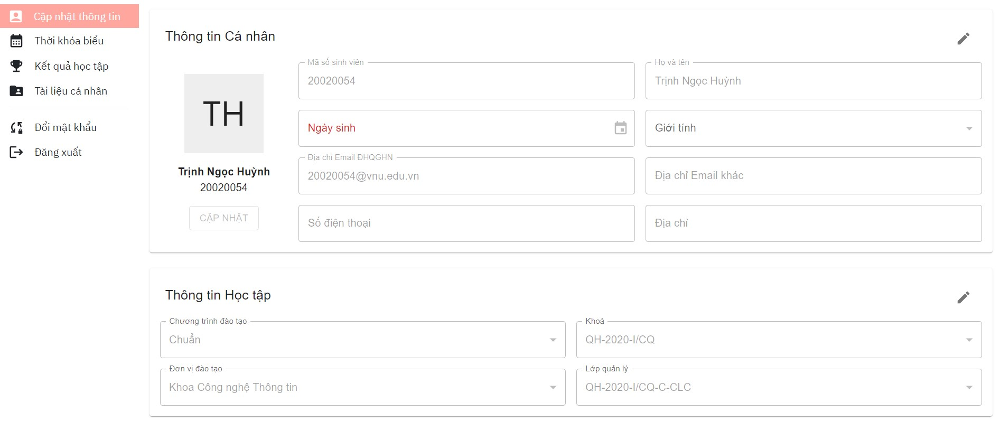
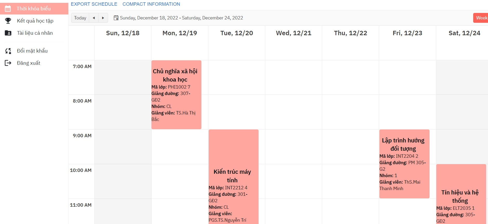
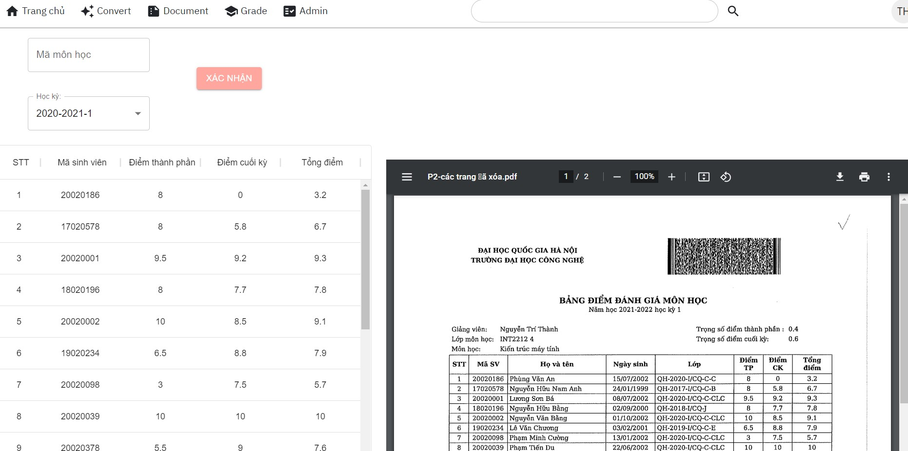
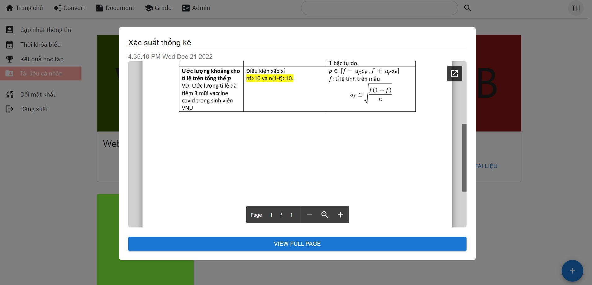

# **OneUET-Project**
## **1. About this project**
OneUET is a project founded by a team of 6 members who are students of the University of Technology - VNU
### IAI team:
- Trịnh Ngọc Huỳnh (back-end)
- Phạm Gia Linh (front-end)
- Lương Sơn Bá (front-end)
- Đặng Xuân Lộc (front-end)
- Phạm Tiến Du (front-end)
- Đặng Trần Hoàng Hà (front-end)
## **2. Set Up**
This project uses ReactJS for the front-end, NodeJS and MySQL for the back-end. Make sure you have installed the lastest version of ReactJS and NodeJS.
### 1. Clone the repository
    https://github.com/huynhspm/OneUET-Project.git
### 2. Install the dependencies
    cd OneUET-Project/backend
    npm install
    
    cd OneUET-Project/frontend
    npm install
### 3. Run project 
Before run project:
- Add some environment to file .evn in back-end for services such as: send email, download from google driver, ....
- Create a database named w22g9_oneuet and connect to this database   
- Ignore comment "await createData();" in line 28 of app.js in back-end to create data for database 

Run back-end and front-end in terminal:   

    cd OneUET-Project/backend
    npm start
    
    cd OneUET-Project/frontend
    npm start
### 4. This project will be running at localhost:3000 on your browser

 

